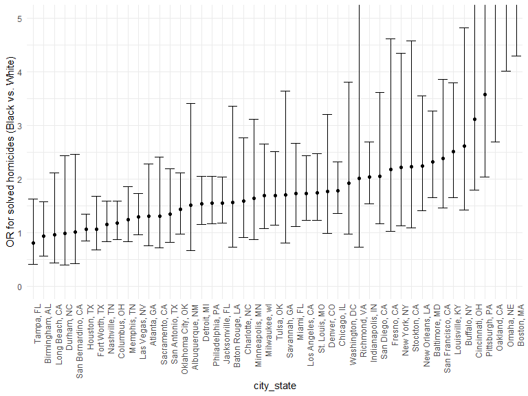
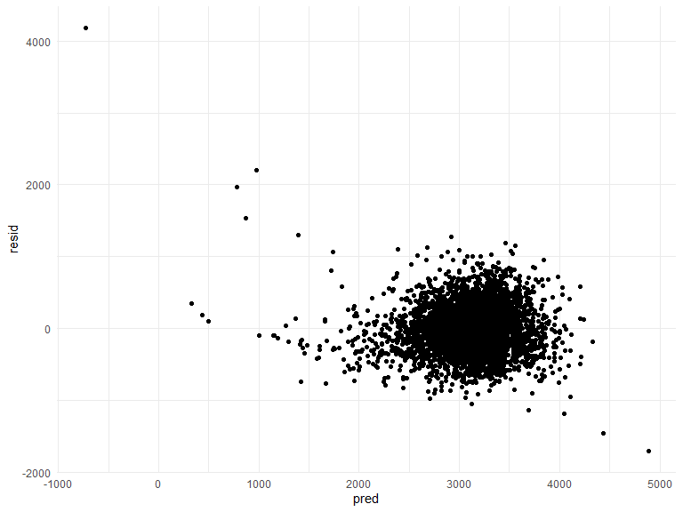
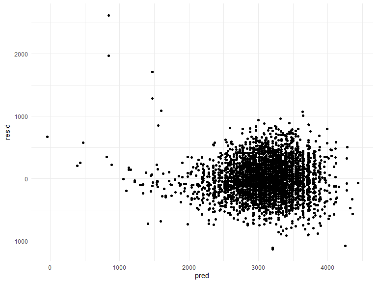
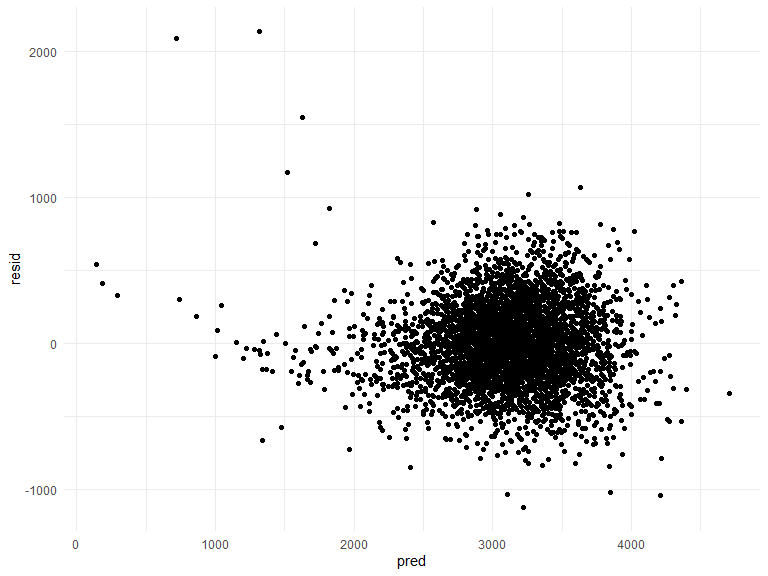
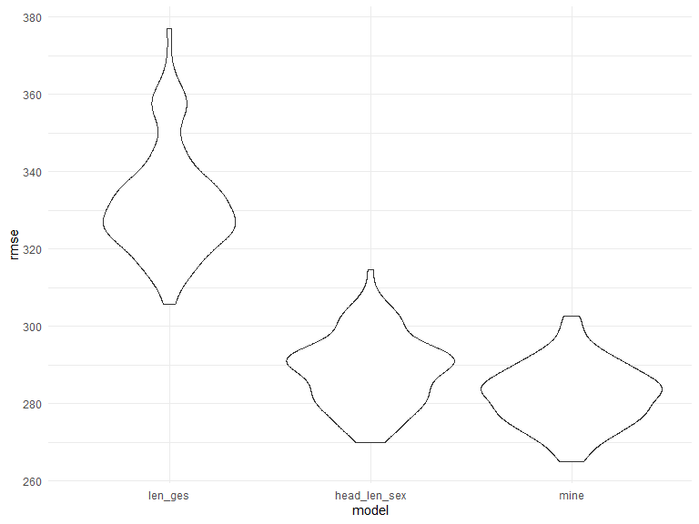
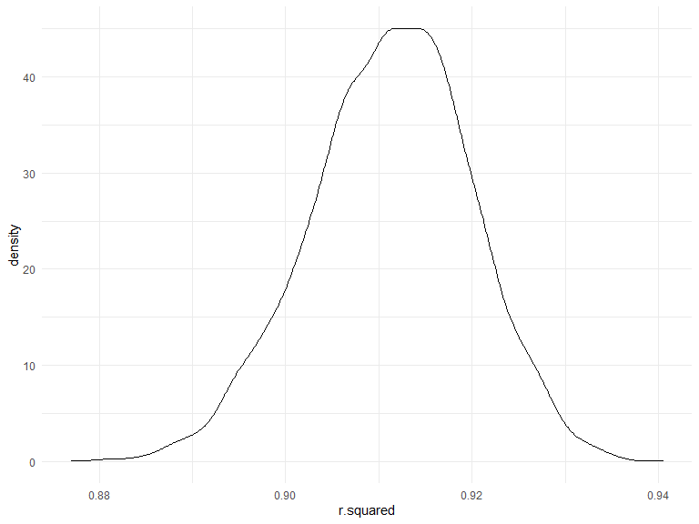
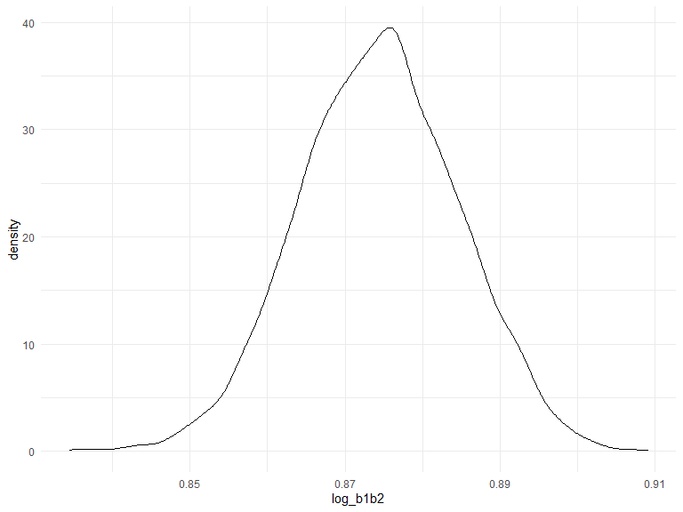

p8105\_hw6\_hq2182
================
Hanfei Qi
11/26/2020

### Problem 1

Create a `city_state` variable, (i.e. “Baltimore, MD”);  
binary variable indicating whether the homicide is solved (0 = unsolved,
1 = solved);  
omit cities Dallas, TX; Phoenix, AZ; and Kansas City, MO, did this at
the beginning: na = c("“,”NA“,”Unknown");  
omit Tulsa, AL;  
keep `victim_race` = `white` or `black`, make `victim_age` as numeric.

``` r
homicide_df = 
  read_csv("data/homicide-data.csv", na = c("", "NA", "Unknown")) %>% 
  mutate(
    city_state = str_c(city, state, sep = ", "),
    victim_age = as.numeric(victim_age),
    resolution = case_when(
      disposition == "Closed without arrest" ~ 0,
      disposition == "Open/No arrest"        ~ 0,
      disposition == "Closed by arrest"      ~ 1),
    victim_age = as.numeric(victim_age)) %>% 
  filter(
    city_state != "Tulsa, AL") %>% 
  select(city_state, resolution, victim_age, victim_race, victim_sex)
```

Start with the city of Baltimore, MD, fit a logistic regression with
resolved vs unresolved as the outcome and victim age, sex and race as
predictors;  
Obtain the estimate and confidence interval of the adjusted odds ratio
for solving homicides comparing non-white victims to white victims
keeping all other variables fixed.

``` r
baltimore_df =
  homicide_df %>% 
  filter(city_state == "Baltimore, MD") %>% 
  mutate(
    victim_race = factor(victim_race, levels = c("White", "Black", "Hispanic", "Asian", "Other"))
  )


glm(resolution ~ victim_age + victim_race + victim_sex, 
    data = baltimore_df,
    family = binomial()) %>% 
  broom::tidy() %>% 
  mutate(
    OR = exp(estimate),
    CI_lower = exp(estimate - 1.96 * std.error),
    CI_upper = exp(estimate + 1.96 * std.error)
  ) %>% 
  select(term, OR, starts_with("CI")) %>% 
  knitr::kable(digits = 3)
```

| term                 |    OR | CI\_lower | CI\_upper |
| :------------------- | ----: | --------: | --------: |
| (Intercept)          | 3.287 |     2.075 |     5.209 |
| victim\_age          | 0.993 |     0.986 |     0.999 |
| victim\_raceBlack    | 0.431 |     0.306 |     0.607 |
| victim\_raceHispanic | 0.767 |     0.412 |     1.427 |
| victim\_raceAsian    | 1.345 |     0.369 |     4.905 |
| victim\_raceOther    | 0.464 |     0.082 |     2.620 |
| victim\_sexMale      | 0.415 |     0.318 |     0.542 |

Do the same thing for all cities in the data;  
extract the adjusted odds ratio (and CI) for solving homicides comparing
Black victims to White victims;

``` r
models_results_df = 
  homicide_df %>% 
  filter(
    victim_race %in% c("Black","White")) %>% 
  nest(data = -city_state) %>% 
  mutate(
    models = 
      map(.x = data, ~glm(resolution ~ victim_age + victim_race + victim_sex, data = .x, family = binomial())),
    results = map(models, broom::tidy)
  ) %>% 
  select(city_state, results) %>% 
  unnest(results) %>% 
  mutate(
    OR = exp(estimate),
    CI_lower = exp(estimate - 1.96 * std.error),
    CI_upper = exp(estimate + 1.96 * std.error)
  ) %>% 
  select(city_state, term, OR, starts_with("CI")) %>% 
  filter(term == "victim_raceWhite")

head(models_results_df)
```

    ## # A tibble: 6 x 5
    ##   city_state      term                 OR CI_lower CI_upper
    ##   <chr>           <chr>             <dbl>    <dbl>    <dbl>
    ## 1 Albuquerque, NM victim_raceWhite  1.51     0.668     3.41
    ## 2 Atlanta, GA     victim_raceWhite  1.31     0.749     2.28
    ## 3 Baltimore, MD   victim_raceWhite  2.32     1.65      3.27
    ## 4 Baton Rouge, LA victim_raceWhite  1.56     0.729     3.36
    ## 5 Birmingham, AL  victim_raceWhite  0.934    0.553     1.58
    ## 6 Boston, MA      victim_raceWhite 10.6      4.30     26.3

Create a plot that shows the estimated ORs and CIs for each city;  
Organize cities according to estimated OR;  
Zoom in the plot because some cities have very large OR, but most ORs
are in range 1\~4.

``` r
models_results_df %>% 
  mutate(city_state = fct_reorder(city_state, OR)) %>% 
  ggplot(aes(x = city_state, y = OR)) + 
  geom_point() + 
  geom_errorbar(aes(ymin = CI_lower, ymax = CI_upper)) + 
  ylab("OR for solved homicides (Black vs. White)") +
  theme(axis.text.x = element_text(angle = 90, hjust = 1)) +
  coord_cartesian(ylim=c(0,5))
```



Comment: On average, cases with White victim were more likely to be
solved (OR \> 1). In some cities such as Oakland and Boston, the ORs
were larger than 5, even the lower bound of CI was much more greater
than 1. These cities should consider how to deal with discrimination
based on race.

### Problem 2

Read and clean data.

  - The column names are tidy so no need to do anything.
  - Looks like no na’s.
  - Make sure factor variables are factors.
  - Convert units: (pounds to grams, inches to centimeters).

<!-- end list -->

``` r
baby_df = 
  read_csv("./data/birthweight.csv") %>% 
  mutate(
    babysex = factor(babysex),
    frace = factor(frace),
    malform = factor(malform),
    mrace = factor(mrace),
    delwt = delwt * 28.35,
    mheight = mheight * 2.54,
    ppwt = ppwt * 28.35,
    wtgain = wtgain * 28.35
  )
```

Create two required model first.

``` r
model_len_ges = lm(bwt ~ blength + gaweeks, data = baby_df)
model_len_ges %>% 
  broom::tidy() %>% 
  knitr::kable(digits = 3)
```

| term        |   estimate | std.error | statistic | p.value |
| :---------- | ---------: | --------: | --------: | ------: |
| (Intercept) | \-4347.667 |    97.958 |  \-44.383 |       0 |
| blength     |    128.556 |     1.990 |    64.604 |       0 |
| gaweeks     |     27.047 |     1.718 |    15.744 |       0 |

``` r
model_head_len_sex = lm(bwt ~ bhead * blength * babysex, data = baby_df)
model_head_len_sex %>% 
  broom::tidy() %>% 
  knitr::kable(digits = 3)
```

| term                   |   estimate | std.error | statistic | p.value |
| :--------------------- | ---------: | --------: | --------: | ------: |
| (Intercept)            | \-7176.817 |  1264.840 |   \-5.674 |   0.000 |
| bhead                  |    181.796 |    38.054 |     4.777 |   0.000 |
| blength                |    102.127 |    26.212 |     3.896 |   0.000 |
| babysex2               |   6374.868 |  1677.767 |     3.800 |   0.000 |
| bhead:blength          |    \-0.554 |     0.780 |   \-0.710 |   0.478 |
| bhead:babysex2         |  \-198.393 |    51.092 |   \-3.883 |   0.000 |
| blength:babysex2       |  \-123.773 |    35.119 |   \-3.524 |   0.000 |
| bhead:blength:babysex2 |      3.878 |     1.057 |     3.670 |   0.000 |

Note the p-value = 0.000 because it’s smaller than the minimum display
value. Also notice that `bhead:blength` is not significant

A plot of model residuals against fitted values for the first model:
length at birth and gestational age as predictors (main effects only).

``` r
baby_df %>% 
  select(bwt, blength, gaweeks) %>% 
  modelr::add_residuals(model_len_ges) %>% 
  modelr::add_predictions(model_len_ges) %>% 
  ggplot(aes(x = pred, y = resid)) +
  geom_point()
```



Comment: there are some wired values, but overall is good.

A plot of model residuals against fitted values for the second model:
head circumference, length at birth, sex, and all interactions
(including the three-way interaction).

``` r
baby_df %>% 
  select(bwt, blength, bhead, babysex) %>% 
  modelr::add_residuals(model_head_len_sex) %>% 
  modelr::add_predictions(model_head_len_sex) %>% 
  ggplot(aes(x = pred, y = resid)) +
  geom_point()
```



Comment: there are some wired values as well, but overall is good.

Both required models are good. Now consider my own model.  
For the sake of time, I choose variables that I assume to be the most
relevant to baby’s birth weight, and consider two-way interaction only.

Variables include:

  - `bhead`
  - `blength`
  - `delwt`
  - `mheight`
  - `pnumlbw`
  - `ppbmi`
  - `ppwt`
  - `smoken`
  - `wtgain`

<!-- end list -->

``` r
my_mod = lm(
  bwt ~ (bhead + blength + delwt + mheight + pnumlbw + ppbmi + ppwt + smoken + wtgain)^2, data = baby_df)

baby_df %>% 
  modelr::add_residuals(my_mod) %>% 
  modelr::add_predictions(my_mod) %>% 
  ggplot(aes(x = pred, y = resid)) +
  geom_point()
```


Comment: some extreme points exist but still acceptable.

Use stepwise regression to get a proper model. I know that it’s more
appropriate to build a model based on hypothesis, but for the sake of
time just use stepwise regression.

``` r
mod_select = step(my_mod, direction='backward')
```

Copy and paste the result, get `my_mod` and plot residuals against
fitted values.

``` r
my_mod2 = lm(bwt ~ bhead + blength + delwt + mheight + ppbmi + ppwt + smoken + 
    wtgain + bhead:mheight + bhead:ppbmi + bhead:smoken + blength:delwt + 
    blength:mheight + blength:ppbmi + blength:smoken + delwt:ppbmi + 
    delwt:wtgain + mheight:ppbmi + mheight:ppwt + ppwt:wtgain, data = baby_df)

baby_df %>% 
  modelr::add_residuals(my_mod2) %>% 
  modelr::add_predictions(my_mod2) %>% 
  ggplot(aes(x = pred, y = resid)) +
  geom_point()
```



Comment: the new residual plot is almost identical to the previous one.
It’s still acceptable.

Make a comparison three models in terms of the cross-validated
prediction error.  
Save needed variables only in `mod_df`.  
Use dataset `cv_mod` to do CV process, save models, and their `rmse`.

``` r
mod_df = baby_df %>% 
  select(bwt, blength, gaweeks, bhead, babysex, delwt, mheight, pnumlbw, ppbmi, ppwt, smoken, wtgain)

cv_mod = 
  crossv_mc(mod_df, 100) %>% 
  mutate(
    train = map(train, as_tibble),
    test = map(test, as_tibble))

cv_mod = 
  cv_mod %>% 
  mutate(
    mod_len_ges  = map(train, ~lm(bwt ~ blength + gaweeks, data = .x)),
    mod_head_len_sex     = map(train, ~lm(bwt ~ bhead * blength * babysex, data = .x)),
    mod_mine = map(train, ~lm(bwt ~ bhead + blength + delwt + mheight + ppbmi + ppwt + smoken + 
    wtgain + bhead:mheight + bhead:ppbmi + bhead:smoken + blength:delwt + 
    blength:mheight + blength:ppbmi + blength:smoken + delwt:ppbmi + 
    delwt:wtgain + mheight:ppbmi + mheight:ppwt + ppwt:wtgain, data = .x))) %>% 
  mutate(
    rmse_len_ges = map2_dbl(mod_len_ges, test, ~rmse(model = .x, data = .y)),
    rmse_head_len_sex    = map2_dbl(mod_head_len_sex, test, ~rmse(model = .x, data = .y)),
    rmse_mine = map2_dbl(mod_mine, test, ~rmse(model = .x, data = .y)))
```

Plot the prediction error distribution for each model.

``` r
cv_mod %>% 
  select(starts_with("rmse")) %>% 
  pivot_longer(
    everything(),
    names_to = "model", 
    values_to = "rmse",
    names_prefix = "rmse_") %>% 
  mutate(model = fct_inorder(model)) %>% 
  ggplot(aes(x = model, y = rmse)) + geom_violin()
```



It looks like `head_len_sex` and `mine` models are much better than
`len_ges` model. `mine` model is a little bit better than `head_len_sex`
model, even thought there is overlapping bewteen them.

## Problem 3

Download the data.

``` r
weather_df = 
  rnoaa::meteo_pull_monitors(
    c("USW00094728"),
    var = c("PRCP", "TMIN", "TMAX"), 
    date_min = "2017-01-01",
    date_max = "2017-12-31") %>%
  mutate(
    name = recode(id, USW00094728 = "CentralPark_NY"),
    tmin = tmin / 10,
    tmax = tmax / 10) %>%
  select(name, id, everything())
```

Focus on a simple linear regression with `tmax` as the response and
`tmin` as the predictor.  
Use `bootsrap` to generate 5000 samples;  
Fit the linear regression;  
Extract `r.squared` value of each sample;  
Compute common logarithm of product of beta\_zero and beta\_one, then
save as variable `log_b1b2`;  
All results are saved in dataset `est_df`.

``` r
weather_df =
  weather_df %>% 
  select(tmax, tmin)

est_df = weather_df %>% 
  modelr::bootstrap(n = 5000) %>% 
  mutate(models = map(strap, ~lm(tmax ~ tmin, data = .x) ),
         results1 = map(models, broom::tidy),
         results2 = map(models, broom::glance)) %>% 
  select(-strap, -models) %>% 
  unnest(results1, results2) %>% 
  select(.id, term, estimate, r.squared) %>% 
  group_by(.id) %>% 
  mutate(
    log_b1b2 = log10(prod(estimate))
  ) %>% 
  ungroup()
```

Identify the 2.5% and 97.5% quantiles to provide a 95% confidence
interval.  
Note that only one `r.squared` and one `log_b1b2` for each sample.

``` r
est_df %>% 
  filter(term == "tmin") %>% 
  summarize(
    rsqr_ci_lower = quantile(r.squared, 0.025),
    rsqr_ci_upper = quantile(r.squared, 0.975),
    log_ci_lower = quantile(log_b1b2, 0.025),
    log_ci_upper = quantile(log_b1b2, 0.975)
  )
```

    ## # A tibble: 1 x 4
    ##   rsqr_ci_lower rsqr_ci_upper log_ci_lower log_ci_upper
    ##           <dbl>         <dbl>        <dbl>        <dbl>
    ## 1         0.894         0.927        0.854        0.894

Plot the distribution of estimates.  
Firstly, plot distribution of `r.squared`.

``` r
est_df %>% 
  filter(term == "tmin") %>% 
  ggplot(aes(x = r.squared)) + geom_density()
```



Comment: the distribution of `r.squared` looks normal but skewed a
little bit to the left. Furthermore, the shape is too “thin”.

Second, plot distribution of `log_b1b2`.

``` r
est_df %>% 
  filter(term == "tmin") %>% 
  ggplot(aes(x = log_b1b2)) + geom_density()
```



Comment: the distribution of `log_b1b2` looks more normal but still
skewed to the left. However, it’s impossible to have a perfect normal
distribution.
